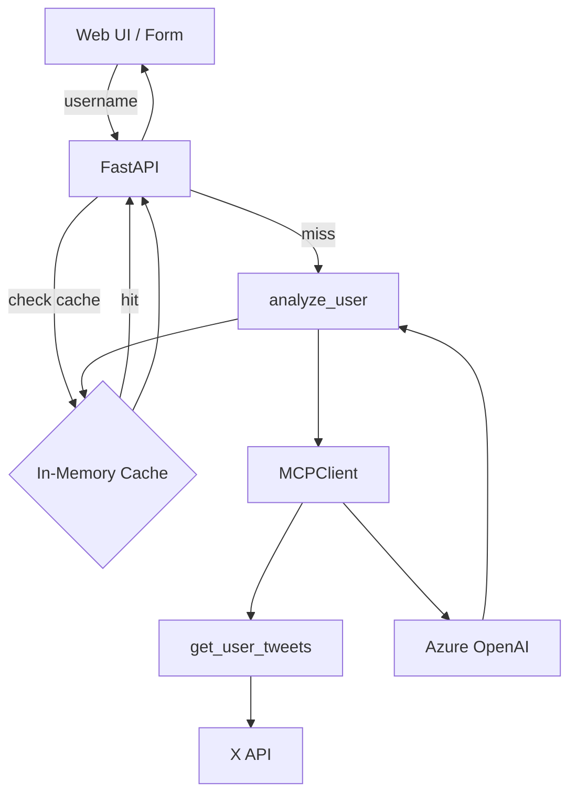

<div align="center">

# X 用户兴趣画像分析平台

基于 MCP (Model Context Protocol) + Azure OpenAI + FastAPI 的示例项目：
通过调用自建的 MCP Tool 抓取某个 X (Twitter) 用户最近 Tweets，再用 Azure OpenAI 进行兴趣与主题偏好分析，并在一个现代化的 Web 界面中展示，同时支持命令行调用与结果缓存。

</div>

---

## ✨ 功能特性

- 🔧 MCP Tool：`get_user_tweets` 获取用户最近多页推文
- 🧠 LLM 分析：调用 Azure OpenAI 对内容进行总结 + 兴趣/关注点挖掘
- 🌐 Web UI：FastAPI + TailwindCSS 高级 UI 设计（玻璃拟态 + 渐变边框）
- ⚡ 缓存机制：6 小时内重复查询直接命中缓存（带命中/刷新徽章）
- 🧪 CLI 支持：可直接在命令行分析任意用户名
- 🛡️ 故障保护：错误信息温和提示，不泄露内部栈信息
- 🔄 强制刷新：可针对已有缓存用户重新分析覆盖

---

## 🗂️ 项目结构

```
src/
	agent.py              # 封装 analyze_user 异步方法 + CLI 入口
	server.py             # MCP FastMCP Tool 服务，提供 get_user_tweets
	webui.py              # FastAPI 应用（Web 界面、缓存、历史）
	templates/
		index.html          # 主页面模板（Jinja2）
	static/
		styles.css          # 抽离的自定义样式
	x_mcp.json            # MCP 客户端配置文件
	pyproject.toml        # 依赖管理 (uv / PEP 621)
	README.md             # 项目说明
	.env (本地自行创建)   # 放置密钥 / 环境变量
```

---

## 🔑 环境变量配置 (.env)

请在根目录创建 `.env`：

```
X_BEARER_TOKEN=你的X Bearer Token
AZURE_OPENAI_DEPLOYMENT_NAME=你的部署名
AZURE_OPENAI_ENDPOINT=https://xxxxx.openai.azure.com/
AZURE_OPENAI_API_VERSION=2024-12-01-preview
```

登录 Azure（若使用 Azure CLI 凭据）：

```
az login
```

---

## 📦 安装依赖

项目使用 [uv](https://github.com/astral-sh/uv) 管理依赖：

```
uv sync
```

如果没有安装 uv：

```
pip install uv
```

---

## 🚀 启动 Web 网站

```
uv run uvicorn webui:app --reload --port 8000
```

访问：`http://127.0.0.1:8000`

### 页面功能说明

| 区域 | 功能 |
|------|------|
| 用户名输入框 | 输入 X 用户名（无需 @）提交分析 |
| 历史记录列表 | 显示最近分析过的用户，含使用次数与上次分析时间差 |
| 分析结果区 | 展示 AI 生成的兴趣画像文本 |
| 缓存命中徽章 | 表示本次读取未重新调用 LLM（减少成本/延迟） |
| 已刷新徽章 | 表示刚刚进行了新的实时分析 |
| 强制刷新按钮 | 忽略缓存重新分析并写入缓存 |
| 清空视图按钮 | 返回空白初始状态（不清除缓存） |

---

## 🛠️ 命令行方式 (CLI)

```
uv run python agent.py elonmusk
```

你也可以换成其他用户名：

```
uv run python agent.py navyblue123
```

CLI 会调用与 Web 相同的 `analyze_user(username)` 方法。

---

## 🧩 内部工作流 (Architecture)



### 关键点
1. 缓存键：用户名小写形式
2. 过期策略：超过 6 小时即失效
3. 空间策略：超过 30 条按时间先后裁剪
4. 分析步骤：
	 - 调用 MCP Tool 拉取 tweets
	 - 组织 Prompt 并调用 Azure OpenAI
	 - 返回分析文本

---

## 🧠 缓存策略说明

| 项 | 说明 |
|----|------|
| 数据结构 | `dict[str, {result, ts, count}]` |
| 过期 TTL | 6 小时 (UTC) |
| 清理时机 | 每次 put 之后自动修剪 |
| 命中判定 | 未过期即命中，并显示“缓存命中” |
| 强制刷新 | `/refresh/{username}` 提交重新生成 |

---

## ✅ 健康检查

```
GET /health -> {"status": "ok"}
```

---

## ❗ 常见问题 (FAQ)

| 场景 | 可能原因 | 解决办法 |
|------|----------|----------|
| 获取 tweets 失败 | `X_BEARER_TOKEN` 缺失或无效 | 检查 `.env` 值 / 重新生成 token |
| Azure 调用失败 | 未 `az login` 或权限不足 | 登录正确订阅 & 检查 endpoint/deployment |
| 分析特别慢 | 模型延迟或 tweets 太多 | 限制页数 / 重试 / 升级模型规格 |
| 缓存不生效 | 重启进程导致内存清空 | 需要持久化可改为 Redis / SQLite |
| 刷新无变化 | 用户最近内容未更新 | 这是正常现象 |

---

## 🔒 生产化改进建议

- 使用 Redis 取代内存缓存，支持多实例扩展
- 给 tweets 拉取层增加错误重试与速率限制
- 将 analyze_user 的 Prompt 模板化并版本化管理
- 接入前端打包（Vite / Tailwind JIT 构建）减少首屏体积
- 增加输入节流与调用配额（防止滥用）
- 结构化输出（JSON Schema + 可视化雷达图）

---

## 🧪 简单本地测试

```python
from agent import analyze_user
import asyncio

async def demo():
	print(await analyze_user("elonmusk"))
asyncio.run(demo())
```

---

## 📝 License

MIT Licensed. 仅供学习与演示使用，不保证商用稳定性。

---

如果你想继续扩展（结构化画像、行业分类、图表可视化、国际化、多模型对比），随时提出！

